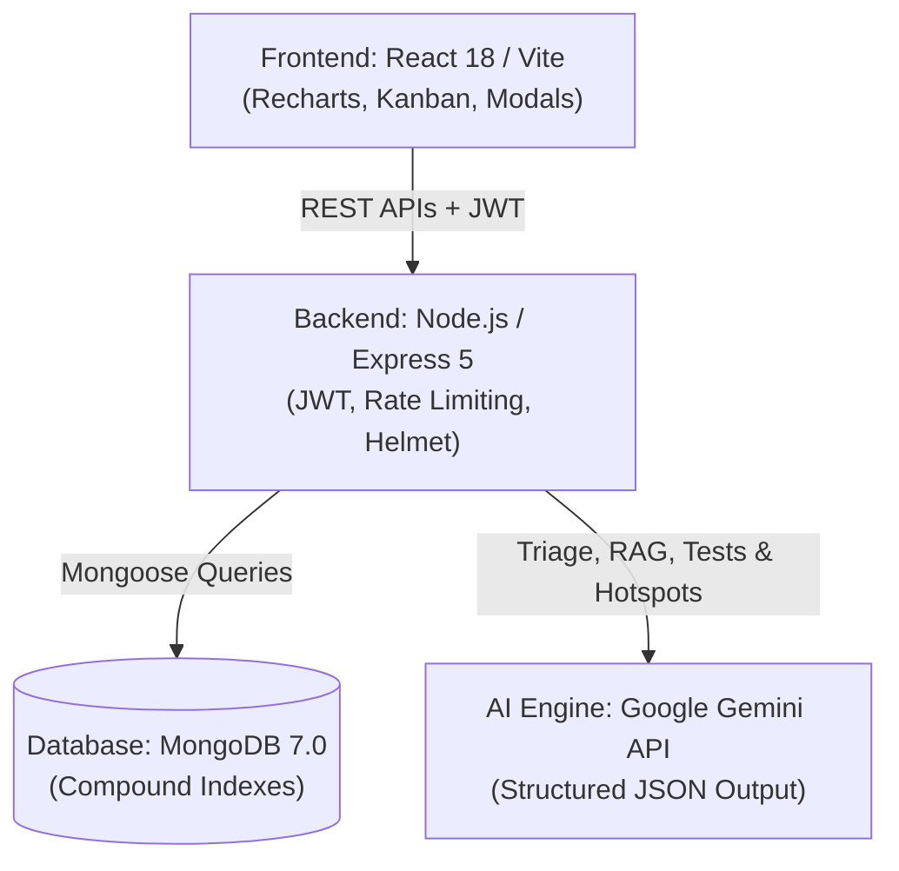

# 🐞 DefectIQ — Intelligent Defect Management & Quality Platform

AI-powered defect tracking, team collaboration, sprint delivery analytics, automated test synthesis, and architectural risk intelligence.

DefectIQ is a full-stack software quality assurance platform built with the **MERN stack** and **Google Gemini API**. It transforms bug tracking from a static issue log into an active, predictive engineering copilot covering the defect lifecycle from reporting to release.

---

## 📌 Milestones & Delivery Status

| Milestone | Focus Domain | Status |
| :--- | :--- | :---: |
| **Milestone 1** | Core defect management foundation, projects, team members, and role tracking | ✅ Completed |
| **Milestone 2** | Controlled defect lifecycle, sprint planning, and core AI engineering triage | ✅ Completed |
| **Milestone 3** | Skill-based developer recommendation, workload balancing, and RAG root cause assistance | ✅ Completed |
| **Milestone 4** | Hotspot fragility heatmaps, Playwright test generation, release notes, and QA audit exports | ✅ Completed |

---

## 🏛️ System Architecture



---

## 🚀 Comprehensive Feature Matrix

### 🐞 Core Defect Lifecycle
* **Structured Issue Ingestion:** Captures title, description, category, affected module, priority, and severity.
* **Priority vs. Severity:** Separates business urgency (**Priority**) from technical impact (**Severity**).
* **Controlled Workflow:** Tracks issues through Open ➔ In Progress ➔ In Review ➔ Resolved ➔ Closed.
* **Audit Trail:** Preserves discussion comments, attachments, and immutable activity history.

### 🤖 AI Engineering Services
* **Automated Bug Triage:** Auto-classifies category, severity, priority, and target module from unstructured text.
* **Semantic Deduplication:** Uses semantic vector comparison to identify duplicate issues before creation.
* **Developer Recommendation:** Matches defects to engineers using domain skills, fix history, and active workload.
* **RAG Root Cause Assistance:** Analyzes error symptoms to suggest debugging and remediation steps.
* **Playwright Test Synthesizer:** Generates executable `@playwright/test` reproduction scripts with selectors and assertions.
* **AI Sprint Health Radar:** Computes sprint delivery risk scores and velocity bottlenecks.
* **Executive Release Notes:** Compiles closed sprint tickets into categorized changelogs and executive summaries.
* **Defect Hotspot Heatmap:** Calculates weighted module fragility to pinpoint technical debt.
* **QA Audit Exporter:** One-click generation of formatted Markdown reports and printable PDF briefs.

---

## 📁 Project Structure

```text
BugTrack-AI/
├── .github/
│   └── workflows/
│       └── ci.yml                   # GitHub Actions CI/CD Pipeline
├── backend/
│   ├── config/                      # Database & environment configurations
│   ├── controllers/                 # Route logic (issues, sprints, auth)
│   ├── middleware/                  # JWT auth, RBAC, error handlers
│   ├── models/                      # Mongoose schemas (Issue, Sprint, User, Team)
│   ├── routes/                      # REST API endpoints
│   ├── services/                    # AI services (Gemini, Hotspot, Release Notes)
│   ├── tests/                       # Automated test suites
│   ├── server.js                    # Express app entry point
│   └── package.json
├── frontend/
│   ├── src/
│   │   ├── components/              # UI components & modals
│   │   ├── pages/                   # Views (Dashboard, Issues, Sprints, Projects)
│   │   ├── services/                # Axios API calls
│   │   ├── App.jsx
│   │   └── main.jsx
│   ├── index.html
│   ├── vite.config.js
│   └── package.json
└── README.md
```

---

## ⚙️ Installation and Setup

### Prerequisites
* **Node.js**: v20.x or higher
* **MongoDB**: Local Community Edition or MongoDB Atlas
* **Google Gemini API Key**: From [Google AI Studio](https://aistudio.google.com/)

---

### 1. Clone the Repository
```bash
git clone https://github.com/Mehak-2005/BugTrack-AI.git
cd BugTrack-AI
```

---

### 2. Backend Setup
```bash
cd backend
npm install
```

Create a `.env` file in the `backend` folder:
```env
PORT=5000
MONGO_URI=mongodb://127.0.0.1:27017/defectiq
JWT_SECRET=your_jwt_secret_key
GEMINI_API_KEY=your_google_gemini_api_key
```

Start the backend server:
```bash
npm run dev
```
The backend will run on `http://localhost:5000`.

---

### 3. Frontend Setup
Open a new terminal window:
```bash
cd frontend
npm install
npm run dev
```
The application interface will open at `http://localhost:5173`.

---

## 🧪 End-to-End Demo Workflow

1. **Defect Ingestion:** On the **Create Issue** page, enter a defect description.
2. **AI Triage & Deduplication:** Gemini classifies category, severity, and module while flagging duplicates.
3. **Smart Assignment:** The system recommends an engineer based on domain matching and capacity.
4. **Kanban & RAG Assistance:** Move tickets across columns and view root-cause advice inside the issue modal.
5. **Auto-Reproduce Test:** Generate an automated Playwright reproduction script with one click.
6. **Sprint Radar & Release Notes:** Review the delivery risk score on the **Sprints** page and generate executive release notes.
7. **Heatmap & QA Audit:** Inspect module fragility on the **Dashboard** and click **Export QA Audit** to print or copy the report.

---

## 🛡️ Reliability & Defensive Design

* **Heuristic Fallbacks:** All Gemini integrations (`hotspotService`, `releaseNotesService`, `autoReproduceService`) use rule-based fallback generators if API limits or timeouts occur, preventing UI failures.
* **Strict Schema Contracts:** Responses use `responseMimeType: "application/json"` with schema constraints to guarantee valid JSON formatting.

---

## 🔄 CI/CD Automation

The GitHub Actions workflow (`.github/workflows/ci.yml`) runs on every push:
* Starts a MongoDB 7.0 container service.
* Runs backend unit and route tests using Jest.
* Verifies frontend build compilation through Vite.

---

## 👩‍💻 Author & Acknowledgments

* **Developer:** Mehak ([@Mehak-2005](https://github.com/Mehak-2005))
